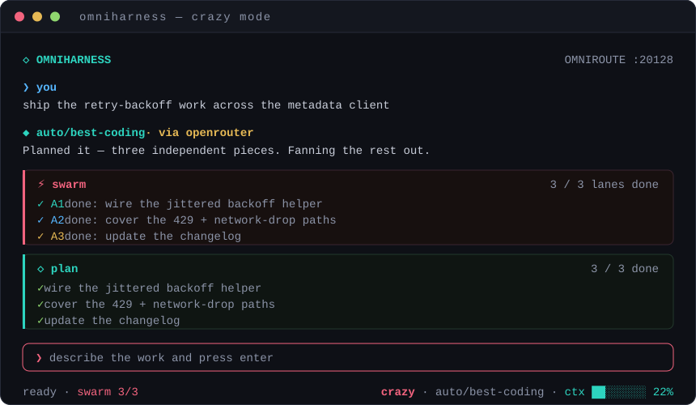

<div align="center">

# OmniHarness

**The agent harness built for [OmniRoute](https://omniroute.ai).**
Route once, run anywhere — plan, build, research, or turn a swarm loose.

[](https://www.npmjs.com/package/omniharness-cli)
[](https://github.com/mattycigemp-crypto/omniharness/actions/workflows/publish.yml)
[](https://nodejs.org)
[](https://go.dev)
[](LICENSE)

<br/>



</div>

---

## Why

If you use OmniRoute, generic coding agents feel slow against it — they were built for one provider and bolt routing on afterward. OmniHarness is the other way round: **OmniRoute is the execution layer, and everything above it is native to that model.** One `provider/model` intent goes out; routing, quota, failover, and provider translation stay where they belong. The result is a harness that stays fast on your gateway and still works phenomenally if you point it somewhere else.

It ships as a polished terminal UI today; a web and desktop front end are on the roadmap over the same core.

## Install

```bash
npm install -g omniharness-cli
```

```bash
omniharness            # launch the interactive TUI in the current directory
```

Point it at your gateway (defaults shown):

```bash
export OMNIROUTE_URL=http://127.0.0.1:20128
export OMNIROUTE_API_KEY=sk-…          # Authorization: Bearer, in memory only — never written to disk
export OMNIROUTE_MGMT_TOKEN=sk-…       # optional: exposes OmniRoute's MCP tools to the agent
```

If the key is unset, the TUI asks for it on launch and holds it in memory only. It is redacted from every surface — logs, sessions, telemetry.

## Modes

Cycle with **`Ctrl+E`**. Each reshapes the system frame and what the agent may touch.

| Mode | What it does | Tools | Approvals |
|------|--------------|-------|-----------|
| **plan** | Investigate, name risks, produce a concrete plan | read-only | — |
| **build** | Implement with minimal changes; a mandatory read → change → verify discipline | full | prompts on writes & commands |
| **research** | Answer with evidence from the workspace | read-only | — |
| **crazy** | Fully autonomous. Auto-approves every call, keeps its own todo queue, and once a plan has ≥ 2 independent steps **fans them out across parallel worker agents** | full | auto |

## The terminal

Everything on screen exists to make agent **intent, action, and history** legible — nothing decorative hides information.

- **Native scrollback is the history.** Settled turns flow straight into your terminal's own buffer; on exit the full plain-text transcript is restored to the primary screen — a real audit trail, no parallel log to maintain.
- **Tear-free streaming** via synchronized output (DECSET 2026), probed at startup alongside the kitty keyboard protocol.
- **Route ribbon.** Every reply is labelled with the provider it actually came from — `via openrouter (failover)` — and failovers land in the transcript as first-class events.
- **Context meter** against the *resolved* model's window, green → amber → red at 70 / 90 %.
- **Per-tool cards** — `$ cmd` with exit-coloured output, `read`, `edit`, unified diffs — collapsed by default, `Ctrl+T` to expand.
- **Scoped-trust approvals** — `y` once · `n` deny · `t` always · pick a scope: exact command → base command → whole tool.
- **Swarm rail** — one lane per parallel worker in crazy mode, coloured by identity, with live progress.
- **Input stays live** during a run: what you type is queued and sent the moment it ends.
- `Ctrl+Y` copies the last reply over OSC 52 (works through SSH); a bell + OSC 9 notification fire when a long run finishes unfocused.
- Session resume, prompt history, `/find`, `/chapters`, and a `Ctrl+L` layout-budget overlay.

<details>
<summary><b>Keys & slash commands</b></summary>

| Key | Action |
|-----|--------|
| `Ctrl+O` | model picker (combos + `auto/*`) |
| `Ctrl+E` | cycle mode |
| `Ctrl+T` | expand / collapse the latest tool card |
| `Ctrl+Y` | copy the last reply to the clipboard |
| `Ctrl+L` | layout-budget overlay |
| `Ctrl+J` | newline (`Shift+Enter` on kitty terminals) |
| `Ctrl+C` | cancel the run, or quit when idle |

`/help` · `/clear` · `/sessions` · `/save <name>` · `/forget <name>` · `/attach <files>` · `/find <text>` · `/chapters`

</details>

## Architecture

Two front ends over one core. `internal/gateway` is the **only** place that talks to OmniRoute — swap it for a direct provider or an in-process stub and the whole suite runs offline.

```
        TUI (npm, Ink/React)          headless CLI (Go, cobra)
                    \                 /
             ┌───────────────────────────────┐
             │          core runtime         │   wiring · lifecycle · typed event spine
             └───────────────┬───────────────┘
        task analyzer → strategy → orchestrator → agents
             │          │            │          │
          budget     policy      tools + MCP   evaluate → repair
                                     │
                          model selection (capability-based)
                                     │
                          gateway.Client  ──►  OmniRoute   ← the only boundary
```

The Go side (`internal/**`) carries the orchestration engine and a scriptable CLI:

```bash
go build ./cmd/omniharness
omniharness doctor                       # check endpoint + auth, safely
omniharness run "fix the failing test"   # headless, current directory
omniharness stack                        # choose the model combo
omniharness sessions | models | serve
```

Full write-up: [`docs/architecture.md`](docs/architecture.md).

## Development

```bash
# TypeScript CLI
cd npm && npm install && npm test && npm run build

# Go core
go vet ./... && go test ./...
```

Every push to `main` runs [`publish.yml`](.github/workflows/publish.yml): it verifies both suites, then publishes `omniharness-cli` via npm **trusted publishing (OIDC)** — no token is stored, provenance is attached automatically.

## License

[MIT](LICENSE)
